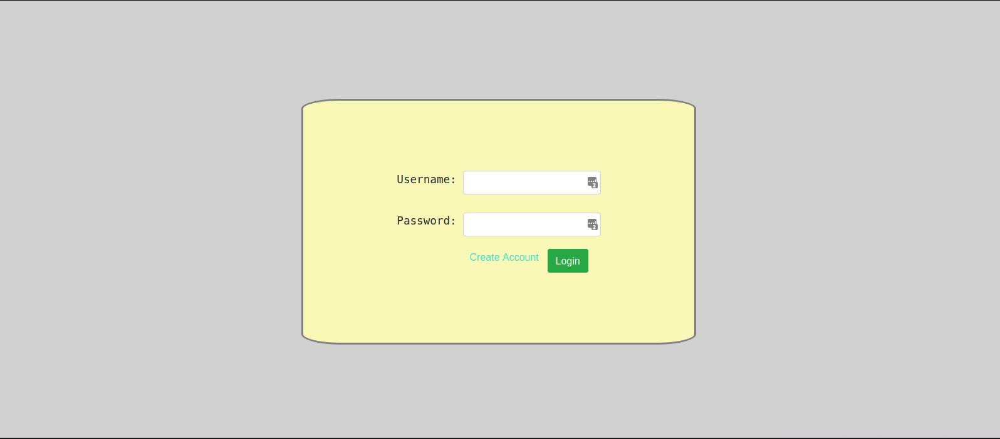
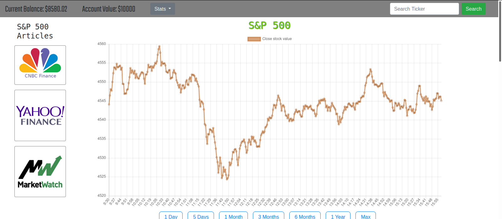
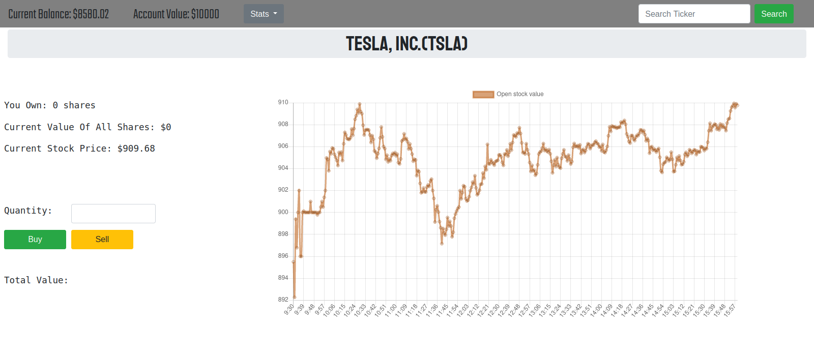
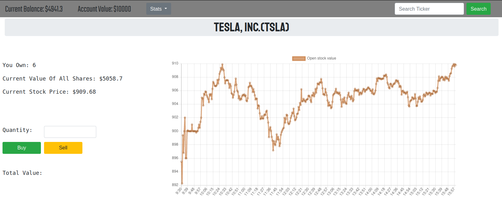

# Mock-Stock
A web application that allows users to simulate trades and investments with real stocks. The server side of the application is handled by Django. Bootstrap is used on the front end for aesthetics and GUI functionality. 

<h2>Project Overview</h2>

Mock Stock was made as a personal project for me to become more aquainted with front-end and back-end development, along with getting comfortable using Django. This application allows users to use fake virtual money to buy and sell stocks at their real prices. The goal, just as in real life, is to make as much money as possible. Each user is able to see how much money they have, how much their portfolio is worth (not currently functioning as of right now), and how many shares they have of all the companies they invested in. Multiple accounts can be made either for new users or users who want to separate the accounts they use for experiemental purposes. 

<h2>How It Works</h2>

A user starts out on the login page where they must either enter a previously created username and password or make a new username and password. 

Upon login, the user is brought to the home page, which displays a graph of the DOW, S&P500, and NASDAQ as a way for the user to quickly see how the stock market is doing at the time of entry. The time intervals for which data is shown on each graph can be changed by the user using the buttons below the graphs. In order for a user to start buying stocks, they must first know the ticker symbol of the company of interest. The company must have stocks traded on the three indexes shown on the home page, otherwise the user cannot buy stocks of the company. To get to the stock page of a certain company, the user can type in the ticker symbol of the company into the search bar and hit the enter button.

This page shows graphical data on a certain company's stock over a given interval of time. Once the user knows how many stocks of the company to buy, they can begin to type it into the "Quantity" field, where the page will update showing the total cost of the quantity of stocks entered. 

Once the user clicks "buy" or "sell", money will be withdrawn from their account and the user will have their stocks saved in the database. 

